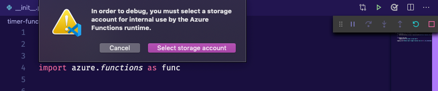

|light| Your first Azure function
=====================================

We will start by creating your first Azure function.
We will make use of VS Code to create a function that works every day at the same time.

Creating your local project
----------------------------

#. Create a new folder on your local computer. This is where your function project will live.

    For example, if using the command line (bash):

    .. code-block:: bash

        mkdir python-functions

        cd python-functions

#. Start VS Code in the project folder (workspace)

    You can use the command line like so:

    .. code-block:: bash

        code .

#. Click on the Azure icon on your activity bar (3 in the image)
#. Then, in the Azure functions area select the Create new project icon (4 in the image)

    .. image:: _static/images/snaps/vs_code_functions1.png
        :height: 600px
        :align: center
        :alt: VS code sidebar icons

#. Provide the following information:

    - **Select the folder that will contain your project**: either choose the current folder or select a different one
    - **Select a language**: Python
    - **Select a Python alias to create a virtual environment**: Select your preferred Python interpreter (needs to be supported)
    - **Select a template**: Timer trigger
    - **Provide a function name**: type a name for your project (I chose ``timer-function``)
    - **Enter a cron expression**: We need to specify when the function will be executed, we do this through cron expressions. A cron expression is a string with 6 separate expressions which represent a given schedule via patterns. For this example I want it to run every day at 9:00 am so I am using: ``0 9 * * * *``

    .. image:: _static/images/snaps/chron.png
        :align: center
        :alt: cron expresion example

.. note:: The default time zone for Azure Functions is UTC. Depending on your timezone and purpose you might need to adjust this.

The extension will create a `Python virtual environment <https://docs.python.org/3/tutorial/venv.html>`_ as well as several files for the function:

.. code-block:: bash

    .
    ├── timer-function
    │   ├── __init__.py
    │   ├── function.json
    │   ├── readme.md
    │   └── sample.dat
    ├── .funcignore
    ├── .gitignore
    ├── host.json
    ├── local.settings.json
    ├── proxies.json
    └── requirements.txt

The basics of your new function
----------------------------------

The ``function.json`` file provides main configuration for your function:

.. code-block:: json
    :name: function.json
    :caption: function.json

    {
        "scriptFile": "__init__.py",
        "bindings": [
            {
            "name": "mytimer",
            "type": "timerTrigger",
            "direction": "in",
            "schedule": "0 9 * * * *"
            }
        ]
    }

You will notice that there is a ``bindings`` element. This is marked as ``"direction": "in"`` which will correspond to the incoming signal to trigger the function.
In this case, we are using a cron expression to trigger the function every day at 9:00am.

You will also notice that there is a ``__init__.py`` script (which is also the script file described in the ``function.json`` above).

.. code-block:: python
    :name: __init__.py
    :caption: __init__.py

    import datetime
    import logging

    import azure.functions as func

    def main(mytimer: func.TimerRequest) -> None:
        utc_timestamp = (
            datetime.datetime.utcnow().replace(tzinfo=datetime.timezone.utc).isoformat()
        )

        if mytimer.past_due:
            logging.info("The timer is past due!")

        logging.info("Python timer trigger function ran at %s", utc_timestamp)

Running your function locally
-------------------------------

Now that we have inspected the function, we are ready to run it locally. You can do so by pressing :kbd:`F5`.
This will launch the debugging extension.
Since we are using the timer trigger, we need to set up an Azure storage account. This is mainly to keep logs and other outputs. 
So you might get the following warning the first time you try and run your function locally.

In the following windows, select these options:

- Create a new storage account: make sure to give it a meaningful name (note only letters and numbers are accepted)
- **Resource group**: we want all of our services to be together so choose to create a new resource group and give it a name
- **Region**: this corresponds to the datacentre where your resources will be located (for example Central US)

.. note:: You will need to be logged into Azure for you to be able to create your Storage Account. If you need help with this check :ref:`login_azure`.

Once your storage account is created (if needed), you should see the output of the Azure function in your terminal.

.. image:: _static/images/snaps/functions_debug.png
    :align: center
    :alt: Running functions locally

If I change the cron expression to run every hour at 10 mins past the hour ``10 */1 * * * *`` for demo purposes. Then in the console output I should see when the fynction is due:

.. code-block:: bash

    [15/04/2020 19:28:58] The next 5 occurrences of the 'timer-function' schedule (Cron: '10 * * * * *') will be:
    [15/04/2020 19:28:58] 04/15/2020 20:29:10+01:00 (04/15/2020 19:29:10Z)
    [15/04/2020 19:28:58] 04/15/2020 20:30:10+01:00 (04/15/2020 19:30:10Z)
    [15/04/2020 19:28:58] 04/15/2020 20:31:10+01:00 (04/15/2020 19:31:10Z)
    [15/04/2020 19:28:58] 04/15/2020 20:32:10+01:00 (04/15/2020 19:32:10Z)
    [15/04/2020 19:28:58] 04/15/2020 20:33:10+01:00 (04/15/2020 19:33:10Z)
    [15/04/2020 19:28:58] 
    [15/04/2020 19:28:58] Host started (1961ms)
    [15/04/2020 19:28:58] Job host started
    Hosting environment: Production
    Content root path: /myuser/demos/functions-python
    Now listening on: http://0.0.0.0:7071
    Application started. Press Ctrl+C to shut down.

Further down the output you should see when the function is next due:

To stop the function, you can press kbd:`CTRL + C`.

.. _login_azure:

Log into Azure from VS Code
-----------------------------

1. If you aren't already signed in, choose the Azure icon in the Activity bar. In the Azure: Functions area, select Sign in to Azure.

    .. image:: https://docs.microsoft.com/en-us/azure/includes/media/functions-sign-in-vs-code/functions-sign-into-azure.png
        :alt: VS code sign in
        :align: center

2. When prompted in the browser, choose your Azure account and sign in using your Azure account credentials.
3. After you've successfully signed in, you can close the new browser window. The subscriptions that belong to your Azure account are displayed in the Sidebar. You should also be able to see the email you have logged into on the bottom status bar in VSCode.

|floppy| Additional resources and docs
---------------------------------------

- `Time trigger for Azure functions official docs <https://docs.microsoft.com/en-us/azure/azure-functions/functions-bindings-timer?tabs=csharp?WT.mc_id=pycon_tutorial-github-taallard>`_
- `Azure functions cron cheatsheet <https://arminreiter.com/2015/02/azure-functions-time-trigger-cron-cheat-sheet/>`_
- `Cron generator <https://crontab.guru/#0_9_*_*_*>`_
- `Cron tab cheatsheet <https://www.codementor.io/@akul08/the-ultimate-crontab-cheatsheet-5op0f7o4r>`_
- A handy blog about dealing with `Time Zones <https://dev.to/azure/getting-rid-of-time-zone-issues-within-azure-functions-4066>`_ in Azure functions
- Azure functions `project structure docs <https://docs.microsoft.com/en-us/azure/azure-functions/functions-develop-vs-code?tabs=csharp#generated-project-files?WT.mc_id=pycon_tutorial-github-taallard>`_
- Human Cron expression `descriptor <https://cronexpressiondescriptor.azurewebsites.net/>`_  super handy if you are only getting familiar with cron expressions
