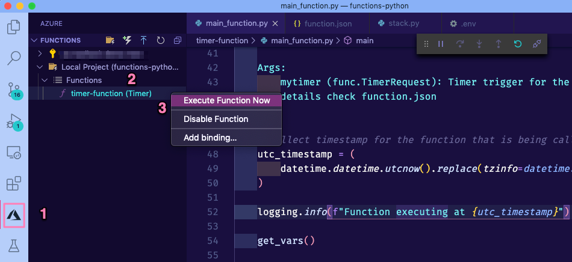

|api| Data acquisition with functions
=========================================

We already have a working and deployed function, but so far it is not doing anything exciting.

Let's start working on the data processing part of the function.

.. tip:: The repository containing all the scripts and solutions to this tutorial can be found at `<https://github.com/trallard/pycon2020-azure-functions>`_.

    👉🏼 The code for this section is located in `<https://github.com/trallard/pycon2020-azure-functions/tree/master/solutions/01-timer-function-data-acquisition>`_ 

The details
-------------
To demonstrate the capabilities of Azure functions for data processing scenarios, we will build the following pipeline:

#. Collect data from the `StackExchange API <https://api.stackexchange.com/>`_ using the timer trigger. We will focus on extracting questions from StackOverflow within a time range and with specific tags.
#. Store the raw data in our Azure storage account.
#. Trigger the processing function that cleans the data and leaves it in a usable format.

Let's get started!

Connecting to the StackExchange API
-------------------------------------

1. Create necessary files and dirs
*********************************** 

In the :ref:`functions101` section we created a basic timer function and explored the generated files.

To keep things neat we are going to create a ``utils`` folder as well and ``__init__.py`` and ``stack.py`` file in it. From the command line (bash):

.. code-block:: bash

    mkdir -p <your-function-dir>/utils
    touch <your-function-dir>/utils/__init__.py 
    touch <your-function-dir>/utils/stack.py 

2. Add methods 
*****************************

Now that we have the necessary files we have to update  ``utils/stack.py`` to handle the requests to the StackExchange API:

.. literalinclude:: ../solutions/01-timer-function-data-acquisition/timer-function/utils/stack.py
        :language: python
        :caption: utils/stack.py

Note how we use the trigger time to set the ``todate`` and ``fromdate`` in the StackExchange query. 

So we need to modify the main script for our function too:

.. literalinclude:: ../solutions/01-timer-function-data-acquisition/timer-function/main_function.py
        :language: python
        :caption: __init__.py

3. Tidying and finishing off
*****************************

1. To make it easier to identify files we will rename the function script to ``main_function.py``:

    .. image:: _static/images/snaps/main_function.png
            :align: center
            :alt: Function name

.. warning:: You also need to change the name of the ``scriptFile`` in the ``function.json`` file. Otherwise, your function is not able to locate the file.

2. Since we are using *requests* and *python-dotenv* we need to update the ``requirements.txt`` file:

.. literalinclude:: ../solutions/01-timer-function-data-acquisition/requirements.txt
        :language: python
        :caption: requirements.txt

3. Finally, we need to create a ``.env`` file to store API keys and other environment variables for local development and debugging. 

.. code-block:: 
    :caption: .env

    # Stackexchange

    SE_client_id = <your secret>
    SE_client_secret = <your secret>
    SE_key = <your secret>

.. warning:: **Do not** commit this .env file to version control. We will learn later on the tutorial how to securely add variables to your Azure functions. 

.. _localdebug:

4. Debugging and executing locally
*************************************

#. Start the debugging session in VS Code by pressing :kbd:`F5`. You should see the function output in the integrated terminal. 
#. Click on the **Azure** extension on the VS Code sidebar and then expand the Functions section.
#. Right-click on your function name (timer-function) and click on **Execute function now**. 

If everything was correctly updated, then you should see the function output in the VS code integrated terminal.

.. code-block:: bash

    [15/04/2020 14:03:34] Executing 'Functions.timer-function' (Reason='This function was programmatically called via the host APIs.', Id=d900f28c-10e5-4e40-8de1-a17079674139)
    [15/04/2020 14:03:34]  INFO: Received FunctionInvocationRequest, request ID: 4bab6cbc-a5eb-4ce9-9cb5-4580ca431de3, function ID: c8491e7b-4c49-4546-9a0a-5a07ba7e2020, invocation ID: d900f28c-10e5-4e40-8de1-a17079674139
    [15/04/2020 14:03:34] Function executing at 2020-04-15T14:03:34.755770+00:00
    [15/04/2020 14:03:34] Dotenv located, loading vars from local instance
    [15/04/2020 14:03:35] 🐍 Collected 30 new questions for the search term
    [15/04/2020 14:03:35]  INFO: Successfully processed FunctionInvocationRequest, request ID: 4bab6cbc-a5eb-4ce9-9cb5-4580ca431de3, function ID: c8491e7b-4c49-4546-9a0a-5a07ba7e2020, invocation ID: d900f28c-10e5-4e40-8de1-a17079674139
    [15/04/2020 14:03:35] Executed 'Functions.timer-function' (Succeeded, Id=d900f28c-10e5-4e40-8de1-a17079674139)

.. _deployandrun:

5. Deploying your updated function
************************************

First, make sure to stop the localhost. You can do this either pressing the :kbd:`Ctrl + C` keys or clicking on the disconnect button from the debugging bar:

.. image:: _static/images/snaps/disconnect.png
            :align: center
            :alt: Disconnect

To deploy your updated function:

1. Click on the Azure extension on the VS Code sidebar and then click on the deploy to function app on the Azure functions section.

2. Select the name of the app that you used before (since we want to update the existing instance).

    .. image:: _static/images/snaps/redeploy.png
        :align: center
        :alt: Confirm deployment

3. Head over to |azureportal| and follow the same instructions as in :ref:`portalinst` to get to your function main page:

    .. image:: _static/images/snaps/configuration.png
        :align: center
        :alt: Function config

4. Click on **Configuration** and in the following screen click on + **New application setting** (1 in the image) to add the keys you stored in your local ``.env`` file.
Add one by one as a separate value-pair (should look like 2 in image).

    .. image:: _static/images/snaps/vars.png
                    :align: center
                    :alt: Variables settings 

5. Once completed, click on the Save button on the top bar (3 in image above).
6. Execute your function on the cloud: go back to your function main page in |azureportal|. Then click on the name of your function (1 in the image below) and then on the **Run** button on the top right (2 in image).

    .. image:: _static/images/snaps/cloud_run.png
                    :align: center
                    :alt: Run function on the cloud

You can now head to the monitor section of your function and see the logs and status of the run you just started.

|floppy| Additional resources and docs
---------------------------------------

- `Stack Exchange API docs <https://api.stackexchange.com/docs/>`_ 
- `Azure functions management <https://docs.microsoft.com/en-us/azure/azure-functions/functions-how-to-use-azure-function-app-settings?WT.mc_id=pycon_tutorial-github-taallard>`_ 