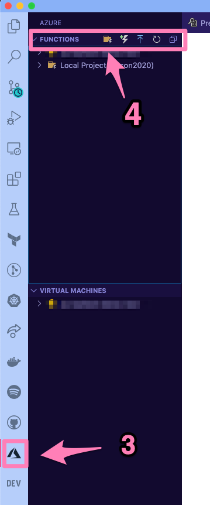

Creating your first Azure function
=====================================

We will start by creating your first Azure function. 
We will make use of VS Code to create a function that works every day at the same time. 

Creating your local project
----------------------------

#. Create a new folder in your local computer. This is where your function project will live.

    For example if using the command line (bash):

    .. code-block:: bash 

        mkdir python-functions

        cd python-functions 

#. Open VS Code and the project folder you just created.

#. Click on the Azure icon on your activity bar (3 in the image)
#. Then, in the Azure functions area select the Create new project icon (4 in the image)

#. Provide the following information:
    - **Select the folder that will contain your project**: either choose the current folder or select a different one
    - **Select a language**: Python
    - **Select a Python alias to create a virtual environment**: Select your preferred Python interpreter (needs to be supported)
    - **Select a template**: Timer trigger
    - **Provide a function name**: type a name for your project (I chose ``timer-function``)
    - **Enter a chron expresion**: We need to specify when the function will be executed. For this example I want it to run every day at 9:00 am so I am using: ``0 0 9 * * *``
    
    .. image:: _static/images/snaps/chron.png
        :align: center     

.. note:: The default time zone for Azure Functions is UTC.

The extension will create a `Python virtual environment <https://docs.python.org/3/tutorial/venv.html>`_ as well as a number of files for the function:

.. code-block:: bash

    .
    ├── timer-function
    │   ├── __init__.py
    │   ├── function.json
    │   ├── readme.md
    │   └── sample.dat
    ├── .funcignore
    ├── .gitignore
    ├── host.json
    ├── local.settings.json
    ├── proxies.json
    └── requirements.txt

The basics of the function
----------------------------

|floppy| Additional resources and docs
---------------------------------------
- `Time trigger for Azure functions official docs <https://docs.microsoft.com/en-us/azure/azure-functions/functions-bindings-timer?tabs=csharp?WT.mc_id=pycon_tutorial-github-taallard>`_ 
- `Azure functions chron cheatsheet <https://arminreiter.com/2017/02/azure-functions-time-trigger-cron-cheat-sheet/>`_ 
- `Chron generator <https://crontab.guru/#0_9_*_*_*>`_ 
- `Chron tab cheatsheet <https://www.codementor.io/@akul08/the-ultimate-crontab-cheatsheet-5op0f7o4r>`_ 
- A handy blog about dealing with `Time Zones <https://dev.to/azure/getting-rid-of-time-zone-issues-within-azure-functions-4066>`_ in Azure functions
- Azure functions `project structure docs <https://docs.microsoft.com/en-us/azure/azure-functions/functions-develop-vs-code?tabs=csharp#generated-project-files?WT.mc_id=pycon_tutorial-github-taallard>`_ 